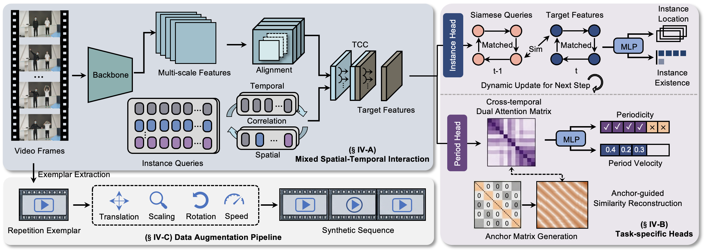

# MultiCounter+: Towards Efficient and Robust Multi-instance Repetitive Action Counting

[](./output%20(2).pdf)
[](https://pytorch.org/)
[](https://opensource.org/licenses/MIT)

> **Official implementation of "MultiCounter+: Towards Efficient and Robust Multi-instance Repetitive Action Counting"**

## 📖 Introduction

**MultiCounter+** introduces a novel and challenging task: **Multi-instance Repetitive Action Counting (MRAC)**. Unlike traditional Repetitive Action Counting (RAC) which focuses on single-instance assumptions, MRAC aims to simultaneously detect multiple human instances, track them over time, and count their repetitive actions in untrimmed videos.

Current methods often fail in real-world scenarios involving:
* **Asynchronous Repetitions:** Multiple people starting/stopping at different times.
* **Varying Frequencies:** Actions performed at different speeds (tempos).
* **Interruptions & Occlusions:** "People in & out" scenarios and camera view changes.

To address these, **MultiCounter+** proposes an end-to-end framework featuring:
1.  **MSTI Module:** Mixed Spatial-Temporal Interaction for efficient context correlation.
2.  **Siamese Queries:** Enhanced temporal consistency to track instances across interruptions.
3.  **Anchor-guided Period Head:** Long-short period awareness to handle varying motion frequencies.


*(Please place Figure 2 from the paper here)*

## 🚀 Main Results

Extensive experiments on the **MultiRep** dataset demonstrate that MultiCounter+ achieves superior performance compared to "Tracking-by-Detection" baselines (e.g., ByteTrack + RepNet).

### 1. Accuracy Comparison (MultiRep Dataset)
MultiCounter+ significantly outperforms state-of-the-art combinations in localization and counting accuracy:

| Method | Period-mAP | AvgMAE | AvgOBO |
| :--- | :---: | :---: | :---: |
| ByteTrack [51] + RepNet [5] | 7.52 | 0.577 | 0.223 |
| ByteTrack [51] + TransRAC [6] | 2.26 | 0.542 | 0.267 |
| **MultiCounter+ (Ours)** | **14.56** | **0.223** | **0.571** |

### 2. Efficiency Comparison
Our method maintains **constant inference time** regardless of the number of instances ($N$), whereas baselines suffer from linear computational growth.

| Method | Inference Time (ms) @ N=1 | Inference Time (ms) @ N=5 | FPS |
| :--- | :---: | :---: | :---: |
| ByteTrack + RepNet | 62.1 | 112.9 | 16.1 |
| **MultiCounter+ (Ours)** | **41.5** | **41.5** | **24.1** |

## 📂 Dataset & Model Zoo

### The MultiRep Dataset
We constructed **MultiRep**, a large-scale dataset specifically for MRAC tasks.
* **Stats:** 1,157 videos containing 52,590 periodic events.
* **Scenarios:** Diverse actions including fitness, sports, and daily activities with clutter and occlusions.

* [**Download MultiRep Dataset**](https://drive.google.com/drive/folders/1kz9pk2WJlneFai7cjxvGx9gpdWk6jLqa?usp=drive_link)

### Pre-trained Models
We provide checkpoints trained using our two-stage strategy: (1) Synthetic Pre-training and (2) MultiRep Fine-tuning.

| Model | Backbone | Training Data | Period-mAP | Download |
| :--- | :--- | :--- | :--- | :--- |
| **MultiCounter+ (Best)** | **ResNet-50-FPN** | **Synthetic + MultiRep** | **14.56** | **https://drive.google.com/file/d/17eHYy4JRxF2bAMjMnLqyXNLmN7zrtw4H/view?usp=drive_link** |

## 🛠️ Installation

### Prerequisites
* Linux or macOS
* Python 3.9+
* PyTorch 1.7.1+ (CUDA 10.1+ recommended)
* MMDetection (based on `mmcv-full`)

### Steps

1.  **Create a conda environment:**
    ```bash
    conda create -n multicounter python=3.9
    conda activate multicounter
    ```

2.  **Install PyTorch and dependencies:**
    ```bash
    # Install PyTorch (Adjust cuda version according to your environment)
    conda install pytorch==1.7.1 torchvision==0.8.2 torchaudio==0.7.2 cudatoolkit=10.1 -c pytorch

    # Install common scientific libraries
    pip install scipy tqdm pandas
    ```

3.  **Install MMDetection and MMCV:**
    MultiCounter+ is built upon MMDetection.
    ```bash
    # Install MMCV-full (Version 1.4.8 is recommended)
    pip install mmcv-full==1.4.8 -f [https://download.openmmlab.com/mmcv/dist/cu101/torch1.7.0/index.html](https://download.openmmlab.com/mmcv/dist/cu101/torch1.7.0/index.html)

    # Install MultiCounter
    cd MultiCounter
    pip install -v -e .
    ```

## 💻 Usage

### 1. Inference Demo
To visualize the counting results on your own videos:
1.  Put your video files in `demo_video/source_video/`.
2.  Run the demo script. The results will be saved in `demo_video/visual_result/`.

```bash
bash tools/code_for_demo/demo.sh

```

### 2. Training

The training process consists of two stages to ensure robust generalization:

**Stage 1: Synthetic Pre-training**
Train the model on the large-scale synthetic dataset generated from RepCount-A to learn basic periodic patterns.

```bash
bash tools/dist_train.sh configs/multicounter/pretrain_synthetic.py 8

```

**Stage 2: Fine-tuning on MultiRep**
Load the pre-trained weights and fine-tune on the MultiRep dataset for real-world adaptation.

```bash
bash tools/dist_train.sh configs/multicounter/finetune_multirep.py 8 --load-from work_dirs/pretrain/epoch_10.pth

```

### 3. Testing

Evaluate the model performance on the MultiRep test set.

```bash
bash tools/test.sh configs/multicounter/finetune_multirep.py work_dirs/finetune/best_mAP.pth --eval period_map

```

## 🤝 Acknowledgement

This project is based on [MMDetection](https://github.com/open-mmlab/mmdetection). We thank the authors for their excellent open-source work.
